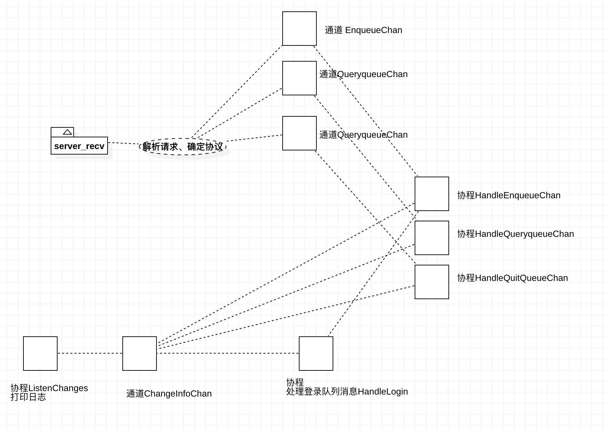
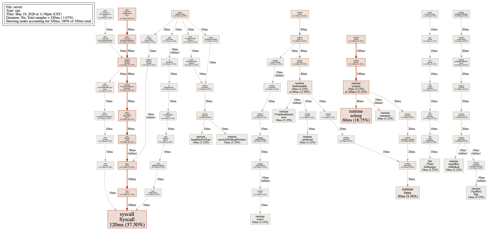
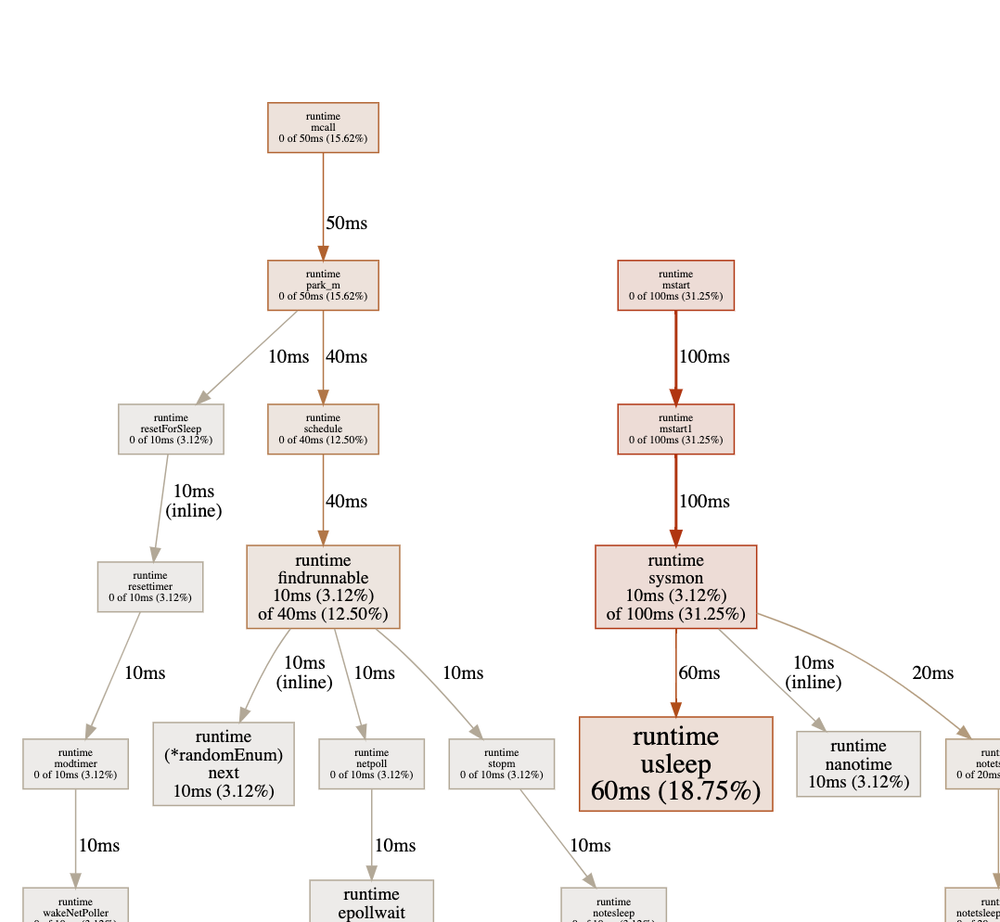
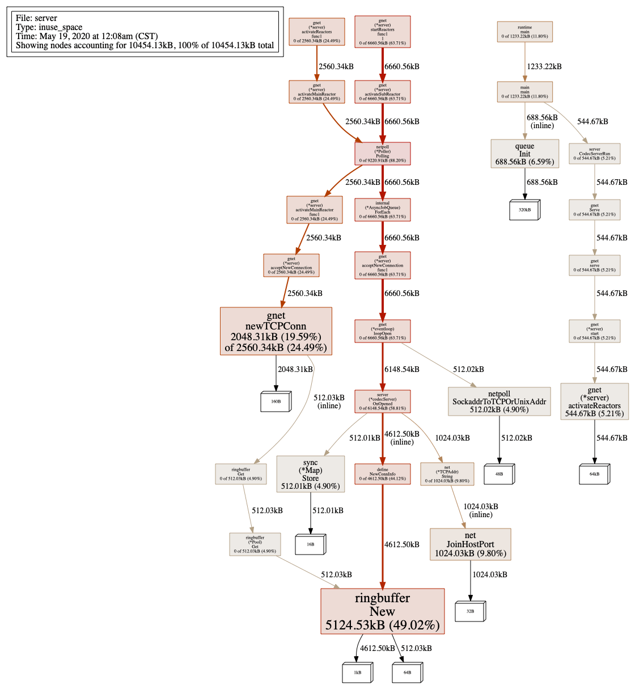
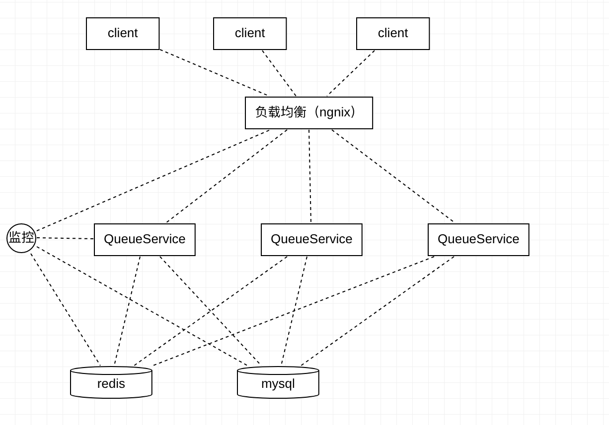

# QueueService

## 一. 功能
	开服排队系统，对到达服务器的大量用户进行队列缓冲，名为QueueService，根据服务器压力情况，逐步让队列中的用户拿到登录服务器的令牌（token），代表该用户请求可以被处理了，从而缓解登录高峰，排队中用户要能够“实时”知道自己在队伍中的位置变更。
	
	已经支持功能
	1.排队的用户能实时查到自己当前所处的位置，一旦排到 异步返回登录服务器令牌（token）且马上进入游戏状态（不允许重复排队，重复排队以第一次为准）
	2.正在排队的用户退出、从缓存中踢出该用户（逻辑踢出并未真正踢出，其他用户位置不变，直到处理到已被踢出的用户消息 直接跳过，其他用户位置才真正变化）
	3.开发人员能够实时看到现在游戏中的用户数和正在排队中的用户数
	
	待开发功能
	1.正在游戏的用户退出(未支持)
	2.增加vip 大v用户专用登录队列
	3.加入自定义协议心跳包

## 二. 实现
	一个客户端，一个服务端，之间通过TCP长链接通信（开启keepalive 心跳）（测试用例中模拟多客户端压测）。
	通信协议命令号：
	CMD_LOGIN_REQ_NO    = 10001 //登录请求
	CMD_LOGIN_RES_NO    = 20001 //登录返回
	CMD_LOGIN_NOTIFY_NO = 30001 //登录异步通知

	CMD_QUERY_PLAYER_LOGIN_QUE_POS_REQ_NO = 10002 //查询玩家在登录队列中的位置 请求
	CMD_QUERY_PLAYER_LOGIN_QUE_POS_RSP_NO = 20002 //查询玩家在登录队列中的位置 返回

	CMD_LOGIN_QUIT_REQ_NO = 10003 //玩家退出等待队列请求
	CMD_LOGIN_QUIT_RSP_NO = 20003 //玩家退出等待队列回复

	通信协议体（二进制）
	协议头
	ProtoHeader struct {
		CmdNo     int64	 //协议命令号
		HeaderLen int32	 //包头长度
		BodyLen   int32  //包体长度
		Version   string //固定长度
	}
	协议体（举一例）
	QueryPlayerLoginQuePosReqBody struct {
		UserName string	//用户名
	}
	整个包（举一例）
	QueryPlayerLoginQuePosReq struct {
		ProtoHeader				//协议头
		QueryPlayerLoginQuePosReqBody		//协议体
	}
	
客户端和服务端通信的时序图	

服务器逻辑图

    服务器逻辑图如上图。
    队列编号问题阐述（注意对队列中编号控制 编号个数不能超过编号队列长度）
    循环编号队列长度：LOGIN_QUEUE_MAX_LEN 
    用户进等待队列直接给编号：playerLoginNum 
    用户当前发放的编号：LoginWaitCurNum
    用户的当前位置计算公式：relativeIndex = define.LOGIN_QUEUE_MAX_LEN - playerLoginNum + LoginWaitCurNum
	

## 三. 使用
	1. 服务器 QueueService/app/server/server.go 文件是服务端入口  go build server.go
	2. 客户端 QueueService/app/client/client.go 文件是客户端入口  go build client.go
	   测试用例 QueueService/app/client/client_test.go   执行命令 go test -test.run TestClient
	   注意（时间仓促 客户端连接服务器ip和端口 手动修改，服务器配置文件QueueService/conf/config.json）
	   control + c 退出

## 四. 测试
    测试机器：虚拟机 centos7
    内存2G  2核
    tcp 连接并发支持 2w+（内存占用7%-8%样子，cpu 占用60%以下）
	
	通过修改QueueService/app/client/client_test.go 
	var goNum int = 10000 来控制并发测试
	
1w并发tcp连接下性能图
cpu：

 
    分析如下：
    全局耗时 有些是 gnet网络框架里的耗时，这部分暂时不考虑优化，我们业务优化主要出现在
    从等待队列获取任务处理时有sleep耗时50ms，再加上系统调用耗时在60ms左右。主要考虑此块
    用协程池处理任务。
    

   
heap：

    内存消耗很少，可以忽略优化
## 五. 部署
	时间仓促（平常上班忙，只有上个周末2020.5.16-2020.5.17 两天开发时间，2020.5.18-2020.5.19 抽时间改下bug、写下readme） 服务器只是单点 
	
规划一个成熟项目部署

## 六. 边界问题处理（程序中都有对应处理）
	1. 粘包
	2. tcp 连接异常断开（各流程阶段）

## 七. 待完善
	1.目前服务器是单点、需要通过三方缓存db（eg：redis） 缓存等待队列相关数据 做成分布式
	2.各种数据并未持久化（db：eg：mysql）
	3.服务端通过三方服务 以守护进程模式启动 QueueService，并监控cpu、内存、rtt 等
	4.现在处理登录等待队列中的消息，目前起了单协程处理此处可以做成协程池
	5.通信协议后期考虑用 Protocol Buffers
	6.日志目前控制台输出，后期肯定要添加日志模块

## 八. 需要注意的问题
    1.  tcp长链接 支持 条数
    ulimit -a 看下需要修改的限制
	
