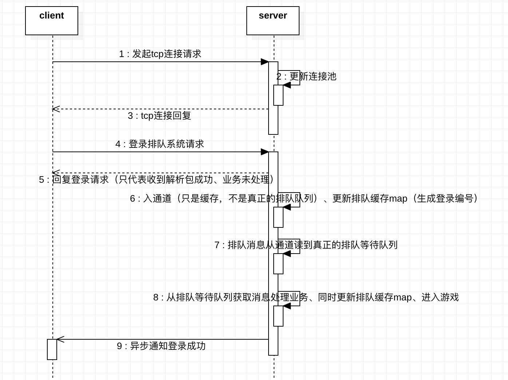

# QueueService

## 一. 功能
	开服排队系统，对到达服务器的大量用户进行队列缓冲，名为QueueService，根据服务器压力情况，逐步让队列中的用户拿到登录服务器的令牌（token），代表该用户请求可以被处理了，从而缓解登录高峰，排队中用户要能够“实时”知道自己在队伍中的位置变更。
	
	已经支持功能
	1.排队的用户能实时查到自己当前所处的位置，一旦排到 异步返回登录服务器令牌（token）且马上进入游戏状态（不允许重复排队，重复排队以第一次为准）
	2.正在排队的用户退出、从缓存中踢出该用户（逻辑踢出并未真正踢出，其他用户位置不变，直到处理到已被踢出的用户消息 直接跳过，其他用户位置才真正变化）
	3.开发人员能够实时看到现在游戏中的用户数和正在排队中的用户数
	
	待开发功能
	1.正在游戏的用户退出(未支持)

## 二. 实现
	一个客户端，一个服务端，之间通过TCP长链接通信（开启keepalive 心跳）（测试用例中模拟多客户端压测）。
	通信协议命令号：
	CMD_LOGIN_REQ_NO    = 10001 //登录请求
	CMD_LOGIN_RES_NO    = 20001 //登录返回
	CMD_LOGIN_NOTIFY_NO = 30001 //登录异步通知

	CMD_QUERY_PLAYER_LOGIN_QUE_POS_REQ_NO = 10002 //查询玩家在登录队列中的位置 请求
	CMD_QUERY_PLAYER_LOGIN_QUE_POS_RSP_NO = 20002 //查询玩家在登录队列中的位置 返回

	CMD_LOGIN_QUIT_REQ_NO = 10003 //玩家退出等待队列请求
	CMD_LOGIN_QUIT_RSP_NO = 20003 //玩家退出等待队列回复

	通信协议体
	协议头
	ProtoHeader struct {
		CmdNo     int64	 //协议命令号
		HeaderLen int32	 //包头长度
		BodyLen   int32  //包体长度
		Version   string //固定长度
	}
	协议体（举一例）
	QueryPlayerLoginQuePosReqBody struct {
		UserName string	//用户名
	}
	整个包（举一例）
	QueryPlayerLoginQuePosReq struct {
		ProtoHeader				//协议头
		QueryPlayerLoginQuePosReqBody		//协议体
	}
	
	客户端和服务端通信的时序图	

	

## 三. 使用

## 四. 测试

## 五. 部署

## 六. 待改进
